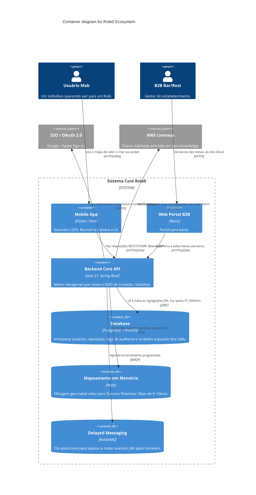
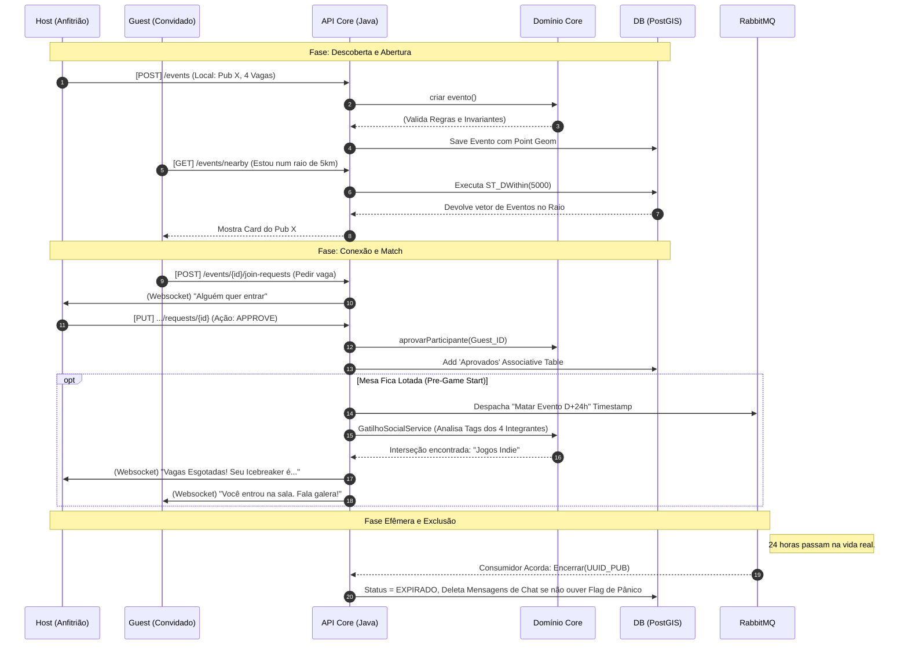

# Diagramas de Arquitetura: Role0

Abaixo estão as representações visuais em *MermaidJS* da arquitetura do aplicativo. Você pode usar uma extensão de pré-visualização no VSCode ou lançar no Live Editor web.

## 1. C4 Model (Container View)
Visão sistêmica descrevendo os componentes interativos do Macro-Ecossistema Role0 e as fronteiras do Hexágono de backend:

---

## 2. Matchmaking Workflow (Fluxograma da Conexão)
Como um evento nasce, transita até lotar, e se extingue fisicamente:

